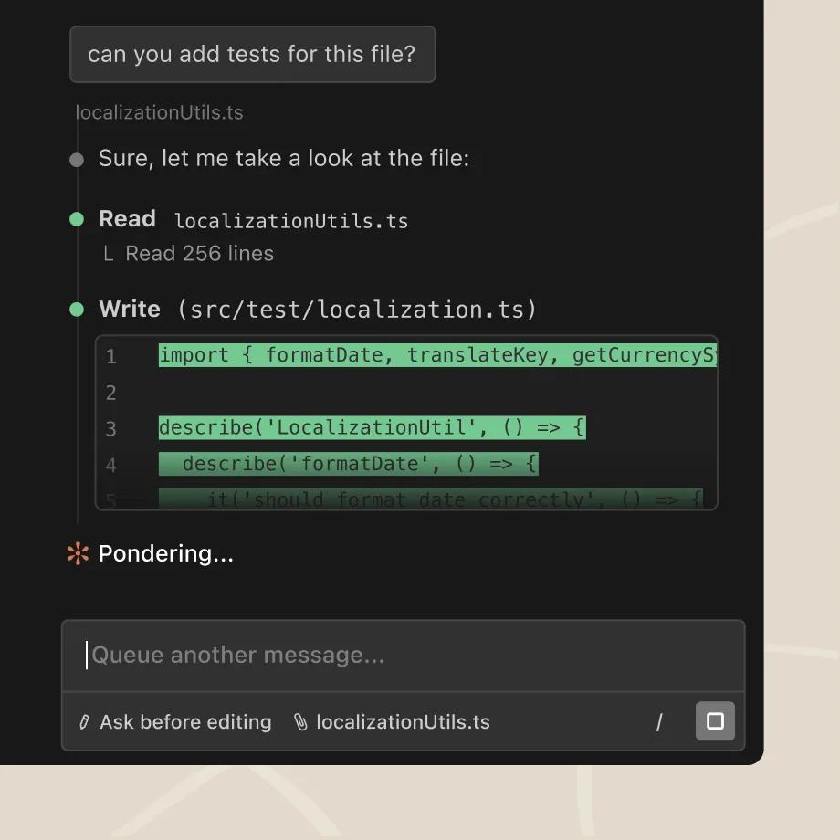
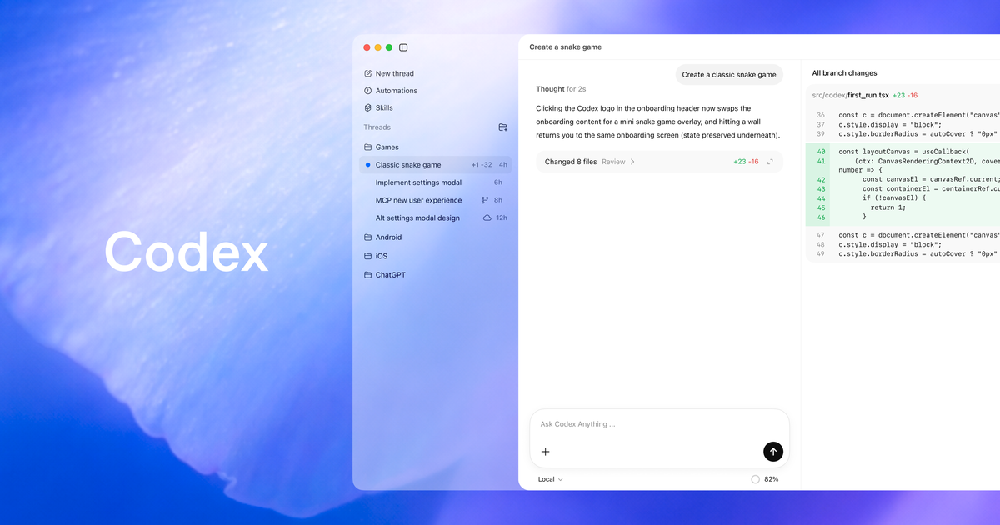
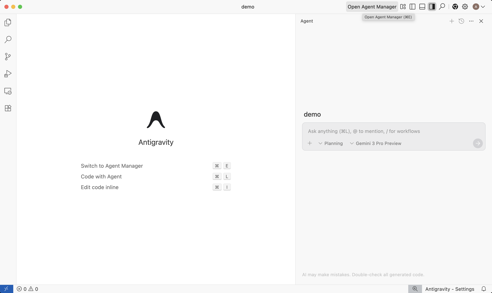
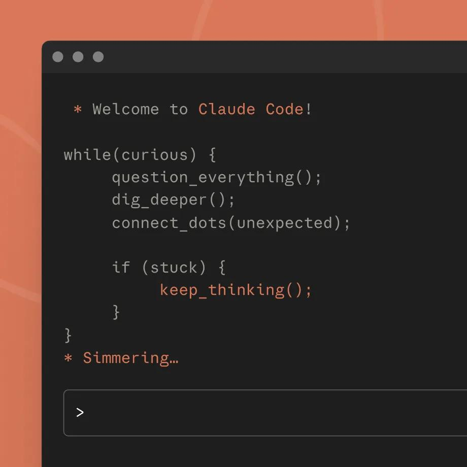
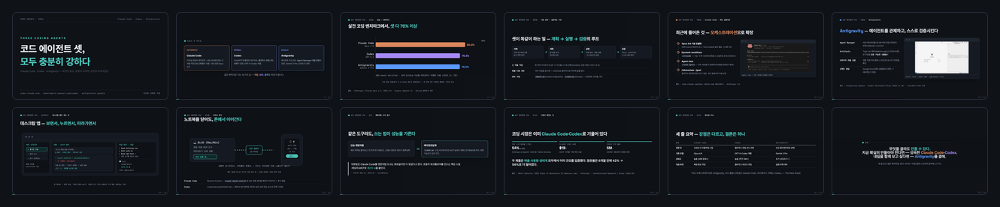
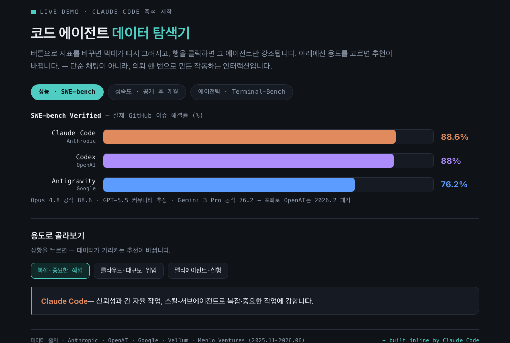

<!--
  대상: 개발 경험이 있는 실무자/팀 (사내 교육·공개 강의)
  형식: 개념·시연 위주 (일부는 발표자가 라이브 시연)
  서사: 도입(패러다임 전환) → 공통점(정량근거: 모두 충분히 강함) → 차별점(플랫폼별, 브랜드색) →
        인터페이스(CLI→데스크탑 권장) → 모바일 → 실전(단순채팅 넘기기)+데모 → 성숙도 결론 → 마무리·출처
  브랜드색: Claude=주황 · Codex=보라 · Antigravity=블루 · 하우스=청록
-->

<div class="cover-telemetry"><span>CODE AGENTS · 2026</span><span>Claude Code · Codex · Antigravity</span></div>

<div class="title-block">
<div class="latin-mark">THREE CODING AGENTS</div>

# 코드 에이전트 셋,<br><em>모두 충분히 강하다</em>

<p class="cover-sub">Claude Code · Codex · Antigravity — 무엇이 같고, 무엇이 다르며, 무엇이 무르익었나</p>
</div>

<div class="cover-foot"><span>code.claude.com · developers.openai.com/codex · antigravity.google</span><span>비교와 선택의 기준</span></div>

---
layout: center
class: text-center
---

<p class="eyebrow">한 장 요약</p>

<p class="lead" style="font-size:1.5rem;max-width:52rem">세 에이전트 모두 <em>원하는 걸 만들기엔 충분히</em> 뛰어나다.<br>다만 <span class="t-claude">플랫폼마다 강한 곳</span>이 다르고,<br>제품의 <span class="t-codex">성숙도</span>는 아직 <b>Claude Code · Codex</b>가 앞선다.</p>

<p style="font-size:0.84rem;color:var(--dim);margin-top:1.4rem">— 오늘 발표가 데이터로 보이려는 한 문장</p>

---

<p class="crumbs"><b>코드 에이전트 비교</b><span>도입</span><em>무엇이 달라졌나</em></p>

# 코드를 <em>짜는</em> 일에서, 에이전트에게 <em>맡기는</em> 일로

<div class="flow">
<div><b>자동완성</b><span>다음 줄을 제안<br>(Copilot 1세대)</span></div>
<div><b>채팅 보조</b><span>물어보고<br>복붙</span></div>
<div><b>코딩 에이전트</b><span>코드베이스를 읽고<br>편집·실행·검증을 스스로</span></div>
</div>

<p class="lead">이제 도구는 <em>전체 코드베이스를 이해하고</em>, 파일을 고치고, 명령을 돌리고, 결과를 스스로 확인한다.</p>

<p class="note"><b>현장</b> 개발자의 <b>90%</b>가 AI 도구를 도입했고, AI 작업에 하루 중앙값 <b>2시간</b>을 쓴다 — DORA 2025.</p>

---
layout: center
---

<p class="eyebrow">오늘의 세 주인공</p>

<div class="trio">
<div class="pane key" style="border-color:var(--claude)"><h3><span class="latin" style="color:var(--claude)">ANTHROPIC</span>Claude&nbsp;Code</h3><p>터미널 태생의 에이전트. 스킬·서브에이전트·긴 자율 작업으로 <b>신뢰성</b>이 강점. 기본 모델 Opus 4.8.</p></div>
<div class="pane key" style="border-color:var(--codex)"><h3><span class="latin" style="color:var(--codex)">OPENAI</span>Codex</h3><p>ChatGPT에 통합된 에이전트. <b>클라우드 위임·코드 리뷰</b>가 강점. GPT-5.5 계열.</p></div>
<div class="pane key" style="border-color:var(--antigravity)"><h3><span class="latin" style="color:var(--antigravity)">GOOGLE</span>Antigravity</h3><p>에이전트 우선 IDE. <b>Agent Manager·자율 검증</b>이 강점. Gemini 3 Pro. 2025.11 공개.</p></div>
</div>

<p style="text-align:center;font-size:0.9rem;color:var(--dim);margin-top:0.4rem">같은 목적지로 가는 세 가지 길 — <span class="t-claude">주황</span>, <span class="t-codex">보라</span>, <span class="t-anti">블루</span>로 따라가 봅니다.</p>

---
class: divider
---

<p class="div-no">01</p>

## 공통점 — 셋 다 충분히 강하다

<p class="div-sub">성능·생산성·기본기는 이미 충분한 수준에 올라섰다</p>

<p class="div-file">정량 근거 · 벤치마크 · 설문</p>

---

<p class="crumbs"><b>코드 에이전트 비교</b><span>공통점</span><em>성능 — 벤치마크</em></p>

# 2년 만에 <em>33% → 89%</em>, 벤치마크가 천장에 닿았다

<figure class="figure">
<svg viewBox="0 0 760 252" width="660" xmlns="http://www.w3.org/2000/svg" role="img" aria-label="SWE-bench Verified 점수 추이: 2024년 GPT-4o 33퍼센트에서 2026년 Claude Opus 4.8 88.6퍼센트로 상승">
  <line x1="55" y1="205" x2="745" y2="205" style="stroke:var(--rule);stroke-width:1.5"/>
  <line x1="55" y1="40" x2="745" y2="40" style="stroke:var(--rule);stroke-width:1;stroke-dasharray:3 6"/>
  <text x="50" y="44" text-anchor="end" style="font-size:10px;font-family:var(--mono);fill:var(--dim)">100%</text>
  <polyline points="130,150 310,124 490,79 660,59" fill="none" style="stroke:var(--accent);stroke-width:2;stroke-dasharray:5 4;opacity:.55"/>
  <rect x="92" y="150" width="76" height="55" rx="4" style="fill:var(--codex)"/>
  <text x="130" y="142" text-anchor="middle" style="font-size:15px;font-family:var(--display);font-weight:700;fill:var(--codex)">33%</text>
  <text x="130" y="224" text-anchor="middle" style="font-size:11px;font-family:var(--mono);fill:var(--ink)">GPT-4o</text>
  <text x="130" y="239" text-anchor="middle" style="font-size:9.5px;font-family:var(--mono);fill:var(--dim)">2024.08</text>
  <rect x="272" y="124" width="76" height="81" rx="4" style="fill:var(--claude)"/>
  <text x="310" y="116" text-anchor="middle" style="font-size:15px;font-family:var(--display);font-weight:700;fill:var(--claude)">49%</text>
  <text x="310" y="224" text-anchor="middle" style="font-size:11px;font-family:var(--mono);fill:var(--ink)">Claude 3.5</text>
  <text x="310" y="239" text-anchor="middle" style="font-size:9.5px;font-family:var(--mono);fill:var(--dim)">2024.10</text>
  <rect x="452" y="79" width="76" height="126" rx="4" style="fill:var(--antigravity)"/>
  <text x="490" y="71" text-anchor="middle" style="font-size:15px;font-family:var(--display);font-weight:700;fill:var(--antigravity)">76%</text>
  <text x="490" y="224" text-anchor="middle" style="font-size:11px;font-family:var(--mono);fill:var(--ink)">Gemini 3 Pro</text>
  <text x="490" y="239" text-anchor="middle" style="font-size:9.5px;font-family:var(--mono);fill:var(--dim)">2025.11</text>
  <rect x="622" y="59" width="76" height="146" rx="4" style="fill:var(--claude)"/>
  <text x="660" y="51" text-anchor="middle" style="font-size:15px;font-family:var(--display);font-weight:700;fill:var(--claude)">88.6%</text>
  <text x="660" y="224" text-anchor="middle" style="font-size:11px;font-family:var(--mono);fill:var(--ink)">Opus 4.8</text>
  <text x="660" y="239" text-anchor="middle" style="font-size:9.5px;font-family:var(--mono);fill:var(--dim)">2026.05</text>
</svg>
<figcaption>SWE-bench Verified — 실제 GitHub 이슈 500개를 고친 비율. 막대 색은 만든 곳: <span class="t-codex">OpenAI</span> · <span class="t-claude">Anthropic</span> · <span class="t-anti">Google</span></figcaption>
</figure>

<p class="note"><b>포화의 신호</b> 너무 쉬워지자 OpenAI는 2026.2에 Verified를 폐기하고 더 어려운 <b>SWE-bench Pro</b>(최고 ~69%)로 옮겼다. 세 곳의 최신 모델이 함께 그 최전선에 있다.</p>

<p class="refs">출처 · <a href="https://www.anthropic.com/news/claude-opus-4-8" target="_blank">Opus 4.8</a> · <a href="https://blog.google/products-and-platforms/products/gemini/gemini-3/" target="_blank">Gemini 3</a> · <a href="https://www.swebench.com/verified.html" target="_blank">SWE-bench</a> · <a href="https://openai.com/index/why-we-no-longer-evaluate-swe-bench-verified/" target="_blank">Verified 폐기 선언</a></p>

---

<p class="crumbs"><b>코드 에이전트 비교</b><span>공통점</span><em>생산성 — 설문</em></p>

# 도입은 끝났고, 이제 <em>일상 도구</em>가 되었다

<div class="bigstat three">
<div class="hot"><i>AI 도구 도입률</i><b>90%</b><span>DORA 2025 — 전년 대비 +14%p</span></div>
<div class="hot"><i>생산성 향상 보고</i><b>80%<small>+</small></b><span>DORA 2025 — AI 작업에 하루 2시간</span></div>
<div class="hot"><i>개발자 AI 사용</i><b>84%</b><span>Stack Overflow 2025 — 49,000명</span></div>
</div>

<p class="lead">DORA의 결론은 한 문장: <em>「AI는 증폭기(amplifier)다」</em> 도구 자체보다, 그것을 감싸는 플랫폼·관행의 성숙도가 가치를 가른다.</p>

<p class="refs">출처 · <a href="https://dora.dev/dora-report-2025/" target="_blank">DORA 2025</a> · <a href="https://survey.stackoverflow.co/2025/ai/" target="_blank">Stack Overflow Developer Survey 2025</a></p>

---

<p class="crumbs"><b>코드 에이전트 비교</b><span>공통점</span><em>기본 능력 — 공유하는 구조</em></p>

# 셋 다 계획하고, 실행하고, <em>스스로 검증한다</em>

<div class="flow">
<div><b>이해</b><span>전체 코드베이스를<br>읽고 맥락 파악</span></div>
<div><b>계획</b><span>할 일을 쪼개<br>접근법 설계</span></div>
<div><b>실행</b><span>파일 편집 · 명령 실행<br>· 도구(MCP) 호출</span></div>
<div><b>검증</b><span>테스트 · 브라우저로<br>스스로 결과 확인</span></div>
</div>

<div class="deflist narrow">
<div><b>긴 자율 작업</b><span>한 번의 지시로 수십 분~수 시간을 스스로 진행 (Codex는 단일 작업 7시간+ 보고)</span></div>
<div><b>병렬·다중 세션</b><span>여러 작업을 동시에 — worktree·클라우드로 격리해 충돌 없이</span></div>
<div><b>영속 지침</b><span><code>AGENTS.md</code>(Codex·Antigravity) · <code>CLAUDE.md</code>(Claude) — 프로젝트 규칙을 기억</span></div>
</div>

---

<p class="crumbs"><b>코드 에이전트 비교</b><span>공통점</span><em>공통 인터페이스·기능</em></p>

# 엔진은 하나, <em>굴리는 표면은 여럿</em>

<div class="split">
<div>
<p class="thesis">셋 다 한 가지 코어를 터미널·IDE·데스크탑·웹·모바일에서 동일하게 굴린다. 아래 기능은 세 제품의 <b>공통 문법</b>이다.</p>

<div class="deflist narrow">
<div><b>멀티 표면</b><span>CLI · IDE 확장 · 데스크탑 앱 · 웹/클라우드 · 모바일</span></div>
<div><b>MCP</b><span>외부 도구·데이터를 잇는 개방 표준 (GitHub·Slack·DB…)</span></div>
<div><b>슬래시·스킬</b><span>반복 워크플로우를 명령·스킬로 패키징</span></div>
<div><b>승인·샌드박스</b><span>읽기전용 → 작업공간쓰기 → 전체접근, 단계별 승인</span></div>
</div>
</div>
<div>
<div class="chips">
<i class="hot">CLI</i><i>IDE 확장</i><i class="hot">데스크탑 앱</i><i>웹 · 클라우드</i><i class="hot">모바일</i>
</div>
<figure class="shot">

<figcaption>예) IDE 확장 — 같은 엔진을 에디터 안에서</figcaption>
</figure>
</div>
</div>

---
class: divider codex
---

<p class="div-no">02</p>

## 차별점 — 플랫폼마다 강한 곳이 다르다

<p class="div-sub">같은 능력 위에 각 팀이 얹은 특별한 한 가지</p>

<p class="div-file">Claude Code · Codex · Antigravity</p>

---
class: claude
---

<p class="crumbs"><b>코드 에이전트 비교</b><span>차별점</span><em>Claude Code</em></p>

# <em>Claude Code</em> — 스킬·서브에이전트로 깊이 가는 신뢰성

<div class="deflist">
<div><b>Skills</b><span><code>SKILL.md</code>로 워크플로우를 패키징 — 필요할 때만 로드, 팀과 공유, 재현 가능</span></div>
<div><b>Subagents</b><span>별도 컨텍스트 창에서 탐색·연구를 병렬 실행 → 메인 대화를 깨끗하게 유지</span></div>
<div><b>Plan mode</b><span>편집 전 계획만 제안 — 실행 전 전략을 사람이 통제</span></div>
<div><b>Hooks</b><span>편집 후 자동 포맷·검사 등 <b>결정론적</b> 자동화(LLM 판단에 안 맡김)</span></div>
<div><b>Checkpoints</b><span>프롬프트마다 자동 저장 → <code>/rewind</code>로 되돌리기</span></div>
</div>

<p class="note"><b>커뮤니티</b> HN "What makes Claude Code so damn good" 스레드 — <em>「여러 파일에 걸친 코드를 읽고 고치는 데 가장 똑똑하다」</em>, <em>「멈춰 세우고 방향을 바꿀 수 있다」</em>.</p>

---
class: claude
---

<p class="crumbs"><b>코드 에이전트 비교</b><span>차별점</span><em>Claude Code · 최신 업데이트</em></p>

# Claude Code는 요즘 <em>오케스트레이션</em>으로 넓어졌다

<div class="split evidence">
<div>
<div class="timeline">
<div><b>Opus 4.8 기본 모델화</b><span>SWE-bench 88.6% 보고 · Fast mode로 같은 품질 ~2.5배 속도</span></div>
<div><b>Dynamic workflows</b><span><code>ultracode</code> — 수십~수백 서브에이전트를 스크립트로 오케스트레이션</span></div>
<div><b>Agent view</b><span><code>claude agents</code> — 모든 세션을 한 화면에서(작업중·입력대기·완료)</span></div>
<div><b>/ultrareview · /goal</b><span>클라우드 멀티에이전트 버그 헌팅 · 조건 충족까지 자동 반복</span></div>
</div>
</div>
<div>
<figure class="shot">

<figcaption>Agent view — 여러 세션을 상태별로 한눈에</figcaption>
</figure>
</div>
</div>

<p class="refs">출처 · <a href="https://code.claude.com/docs/en/whats-new" target="_blank">code.claude.com — What's new</a> · <a href="https://www.anthropic.com/news/claude-opus-4-8" target="_blank">Anthropic 뉴스</a></p>

---
class: codex
---

<p class="crumbs"><b>코드 에이전트 비교</b><span>차별점</span><em>Codex</em></p>

# <em>Codex</em> — 클라우드에 위임하고, 리뷰까지 맡긴다

<div class="deflist">
<div><b>클라우드 위임</b><span>긴 작업을 격리된 클라우드 샌드박스로 보내 <b>백그라운드·병렬</b> 실행 → diff/PR로 회수</span></div>
<div><b>코드 리뷰</b><span>커밋 전 별도 Codex 에이전트가 리뷰 — OpenAI 사내 리뷰의 대다수를 담당</span></div>
<div><b>ChatGPT 통합</b><span>Plus/Pro/Business 플랜에 포함 → 가장 빠른 확산(주간 활성 500만+)</span></div>
<div><b>worktree 병렬</b><span>여러 작업을 동시에, 일관된 코드 스타일로</span></div>
<div><b>GitHub <code>@codex</code></b><span>이슈·PR에서 멘션으로 작업 생성</span></div>
</div>

<p class="note"><b>커뮤니티</b> 개발자 평 — <em>「가장 극적인 개선은 안정성. 1년 전엔 거칠었는데 지금은 워크플로의 핵심」</em>(zackproser, 2026).</p>

---
class: codex
---

<p class="crumbs"><b>코드 에이전트 비교</b><span>차별점</span><em>Codex · 최신 업데이트</em></p>

# Codex는 이제 <em>모바일까지</em> 한 흐름으로 잇는다

<div class="split evidence">
<div>
<div class="timeline">
<div><b>GPT-5.5 · Codex 계열</b><span>Terminal-Bench 2.0 82.7% · SWE-bench Pro 58.6% — 최상위권</span></div>
<div><b>Codex Remote — 모바일 GA</b><span>2026.6 · QR 페어링으로 폰에서 승인·diff 리뷰</span></div>
<div><b>데스크탑 앱 통합</b><span>Task 사이드바 · PR 리뷰 페인 · Artifact 뷰어</span></div>
<div><b>멀티에이전트 위임 · <code>/import</code></b><span>서브에이전트 위임 · Claude Code 설정 가져오기</span></div>
</div>
</div>
<div>
<figure class="shot wide">

<figcaption>Codex — 사이드바·작업·코드를 한 표면에서</figcaption>
</figure>
</div>
</div>

<p class="refs">출처 · <a href="https://developers.openai.com/codex/changelog" target="_blank">Codex Changelog</a> · <a href="https://openai.com/index/introducing-upgrades-to-codex/" target="_blank">OpenAI 뉴스</a></p>

---
class: antigravity
---

<p class="crumbs"><b>코드 에이전트 비교</b><span>차별점</span><em>Antigravity</em></p>

# <em>Antigravity</em> — 에이전트를 관제하고, 스스로 검증시킨다

<div class="split evidence">
<div>
<div class="deflist narrow">
<div><b>Agent Manager</b><span>여러 에이전트를 동시에 띄워 관찰·지휘하는 관제소(Mission Control)</span></div>
<div><b>Artifacts</b><span>Task List·계획·Walkthrough(스크린샷·녹화)로 작업을 <b>검증 가능한 산출물</b>로</span></div>
<div><b>브라우저 자율 검증</b><span>앱을 직접 띄워 클릭·스크린샷으로 자기 변경을 확인</span></div>
<div><b>코멘트 협업</b><span>Google Docs처럼 산출물에 코멘트 → 에이전트가 반영</span></div>
</div>
</div>
<div>
<figure class="shot wide">

<figcaption>Editor View + Agent 패널 · 모델 Gemini 3 Pro</figcaption>
</figure>
</div>
</div>

<p class="refs">출처 · <a href="https://antigravity.google" target="_blank">antigravity.google</a> · <a href="https://developers.googleblog.com/build-with-google-antigravity-our-new-agentic-development-platform/" target="_blank">Google Developers Blog</a></p>

---
class: divider
---

<p class="div-no">03</p>

## 어떻게 쓰나 — CLI에서 데스크탑 앱으로

<p class="div-sub">셋 다 터미널에서 태어났다. 그런데 권하고 싶은 건 데스크탑 앱이다</p>

<p class="div-file">인터페이스의 진화</p>

---

<p class="crumbs"><b>코드 에이전트 비교</b><span>인터페이스</span><em>출발점 — CLI</em></p>

# 모두 <em>터미널</em>에서 태어났다

<div class="split">
<div>
<p class="thesis">파이프·스크립트·자동화에선 CLI를 따라올 게 없다. 셋 다 한 줄로 설치된다.</p>

```bash
# Claude Code
curl -fsSL https://claude.ai/install.sh | bash

# Codex
curl -fsSL https://chatgpt.com/codex/install.sh | sh
```

<p class="note"><b>그러나</b> CLI가 모두에게 최선은 아니다 — 특히 키보드 너머의 작업에서.</p>
</div>
<div>
<figure class="shot">

<figcaption>터미널의 Claude Code</figcaption>
</figure>
</div>
</div>

---

<p class="crumbs"><b>코드 에이전트 비교</b><span>인터페이스</span><em>CLI의 한계</em></p>

# 터미널만으로는, <em>이런 게 불편하다</em>

<div class="deflist">
<div><b>프롬프트 작성·수정</b><span>긴 지시를 쓰다 중간을 고치기 어렵다 — 줄바꿈·엔터가 거슬리고, 마우스를 못 쓴다</span></div>
<div><b>비개발자 진입</b><span>터미널 자체가 장벽 — 기획·디자인 동료가 프롬프트를 쓰기엔 문턱이 높다</span></div>
<div><b>작업 추적</b><span>에이전트가 무슨 도구를 썼고 어떤 파일을 고쳤는지가 <b>텍스트 스트림에 묻힌다</b></span></div>
<div><b>맥락 파악</b><span>파일 트리·diff·미리보기를 한눈에 보기 어렵다 — 계속 명령으로 확인해야</span></div>
</div>

<p class="lead">제품이 성숙하면서, 이 불편을 <em>GUI가 풀기 시작했다.</em></p>

---

<p class="crumbs"><b>코드 에이전트 비교</b><span>인터페이스</span><em>데스크탑 앱이 푸는 것</em></p>

# 데스크탑 앱은 <em>보고, 누르고, 따라가게</em> 한다

<figure class="figure">
<svg viewBox="0 0 820 300" xmlns="http://www.w3.org/2000/svg" role="img" aria-label="데스크탑 앱 구조: 왼쪽 세션 사이드바, 가운데 대화·diff, 오른쪽 작업 추적·파일 패널">
  <rect x="10" y="14" width="800" height="248" rx="12" style="fill:var(--card);stroke:var(--rule);stroke-width:1.5"/>
  <circle cx="34" cy="36" r="5" style="fill:var(--shot-dots)"/><circle cx="52" cy="36" r="5" style="fill:var(--shot-dots)"/><circle cx="70" cy="36" r="5" style="fill:var(--shot-dots)"/>
  <line x1="10" y1="54" x2="810" y2="54" style="stroke:var(--rule);stroke-width:1"/>
  <rect x="22" y="66" width="150" height="184" rx="8" style="fill:var(--paper);stroke:var(--rule)"/>
  <text x="34" y="86" style="font-size:11px;font-family:var(--mono);fill:var(--accent)">세션 사이드바</text>
  <rect x="34" y="98" width="126" height="22" rx="4" style="fill:var(--accent-soft);stroke:var(--accent)"/>
  <text x="44" y="113" style="font-size:10px;font-family:var(--mono);fill:var(--ink)">▸ 로그인 기능</text>
  <rect x="34" y="126" width="126" height="20" rx="4" style="fill:var(--card);stroke:var(--rule)"/>
  <text x="44" y="140" style="font-size:10px;font-family:var(--mono);fill:var(--dim)">▸ 결제 버그</text>
  <rect x="34" y="152" width="126" height="20" rx="4" style="fill:var(--card);stroke:var(--rule)"/>
  <text x="44" y="166" style="font-size:10px;font-family:var(--mono);fill:var(--dim)">▸ 문서 업데이트</text>
  <text x="34" y="200" style="font-size:9.5px;font-family:var(--mono);fill:var(--dim)">병렬 세션을</text>
  <text x="34" y="214" style="font-size:9.5px;font-family:var(--mono);fill:var(--dim)">worktree로 격리</text>
  <rect x="184" y="66" width="372" height="184" rx="8" style="fill:var(--paper);stroke:var(--rule)"/>
  <text x="196" y="86" style="font-size:11px;font-family:var(--mono);fill:var(--accent)">대화 · diff 뷰어</text>
  <rect x="196" y="98" width="348" height="40" rx="5" style="fill:var(--card);stroke:var(--rule)"/>
  <text x="206" y="114" style="font-size:10px;font-family:var(--sans);fill:var(--dim)">「로그인 폼에 검증 추가해줘」</text>
  <text x="206" y="130" style="font-size:9px;font-family:var(--mono);fill:var(--accent)">@ 멘션 · 이미지 첨부 · 마우스로 수정</text>
  <rect x="196" y="146" width="348" height="92" rx="5" style="fill:var(--card);stroke:var(--rule)"/>
  <text x="206" y="164" style="font-size:10px;font-family:var(--mono);fill:var(--ok)">+ const isValid = validate(email)</text>
  <text x="206" y="182" style="font-size:10px;font-family:var(--mono);fill:var(--bad)">- // TODO: validate</text>
  <text x="206" y="206" style="font-size:9.5px;font-family:var(--mono);fill:var(--dim)">특정 줄 클릭 → 인라인 코멘트 → 일괄 제출</text>
  <text x="206" y="224" style="font-size:9.5px;font-family:var(--mono);fill:var(--accent)">+12 −1  ✓ 변경을 눈으로 검토</text>
  <rect x="568" y="66" width="230" height="184" rx="8" style="fill:var(--paper);stroke:var(--rule)"/>
  <text x="580" y="86" style="font-size:11px;font-family:var(--mono);fill:var(--accent)">작업 추적 · 파일</text>
  <text x="580" y="106" style="font-size:9.5px;font-family:var(--mono);fill:var(--ink)">▸ Read  Settings.tsx</text>
  <text x="580" y="122" style="font-size:9.5px;font-family:var(--mono);fill:var(--ink)">▸ Edit  auth.ts</text>
  <text x="580" y="138" style="font-size:9.5px;font-family:var(--mono);fill:var(--ink)">▸ Bash  npm test ✓</text>
  <text x="580" y="154" style="font-size:9.5px;font-family:var(--mono);fill:var(--dim)">— 어떤 도구를 썼는지 보임</text>
  <line x1="580" y1="166" x2="786" y2="166" style="stroke:var(--rule);stroke-dasharray:3 3"/>
  <text x="580" y="184" style="font-size:9.5px;font-family:var(--mono);fill:var(--dim)">📁 src/</text>
  <text x="592" y="200" style="font-size:9.5px;font-family:var(--mono);fill:var(--dim)">components/</text>
  <text x="592" y="216" style="font-size:9.5px;font-family:var(--mono);fill:var(--accent)">auth.ts ●</text>
  <text x="580" y="236" style="font-size:9.5px;font-family:var(--mono);fill:var(--dim)">사이드 파일시스템 뷰</text>
</svg>
<figcaption>한 창에서 — 왼쪽 세션, 가운데 대화·diff, 오른쪽 도구 추적·파일트리 (세 앱이 공유하는 구조)</figcaption>
</figure>

---

<p class="crumbs"><b>코드 에이전트 비교</b><span>인터페이스</span><em>왜 데스크탑인가</em></p>

# 데스크탑 앱을 권하는 <em>네 가지 이유</em>

<div class="quad">
<div class="pane"><h3><span class="latin">①</span>마우스로 편집</h3><p>긴 프롬프트를 쓰고 중간을 고치기 쉽다. 클릭·드래그·첨부가 자연스럽다.</p></div>
<div class="pane"><h3><span class="latin">②</span>모두에게 열림</h3><p>터미널을 몰라도 된다. 기획·디자인 동료도 프롬프트를 쓴다.</p></div>
<div class="pane"><h3><span class="latin">③</span>작업이 보인다</h3><p>어떤 도구를 쓰고 무엇을 고쳤는지 패널로 추적. diff를 눈으로 검토.</p></div>
<div class="pane"><h3><span class="latin">④</span>맥락이 한눈에</h3><p>사이드 파일트리·미리보기·멀티 세션을 한 창에서.</p></div>
</div>

<p class="note"><b>참고</b> CLI가 사라지는 게 아니다 — 자동화·CI는 여전히 CLI. 다만 <em>사람이 대화하며 만드는 작업</em>엔 데스크탑이 편하다.</p>

---

<p class="crumbs"><b>코드 에이전트 비교</b><span>인터페이스</span><em>세 앱의 데스크탑</em></p>

# 세 앱 모두 데스크탑이 있다. <em>방점만 다르다</em>

<div class="trio">
<div class="pane key" style="border-color:var(--claude)"><h3><span class="latin" style="color:var(--claude)">CLAUDE CODE</span>Mac · Win</h3><p>Chat·Cowork·Code 탭. worktree 격리 세션, diff 인라인 코멘트, 내장 브라우저로 <b>자동 검증</b>(autoVerify).</p></div>
<div class="pane key" style="border-color:var(--codex)"><h3><span class="latin" style="color:var(--codex)">CODEX</span>Mac · Win</h3><p>「커맨드 센터」 — 멀티 프로젝트, Local/Worktree/<b>Cloud</b> 모드, Task 사이드바, Artifact 뷰어, 통합 터미널.</p></div>
<div class="pane key" style="border-color:var(--antigravity)"><h3><span class="latin" style="color:var(--antigravity)">ANTIGRAVITY</span>Mac · Win · Linux</h3><p>Editor + <b>Agent Manager</b> 두 표면. 자율 검증 walkthrough가 기본. VS Code 포크.</p></div>
</div>

<p style="text-align:center;font-size:0.86rem;color:var(--dim);margin-top:0.5rem">공통 구조 위에 — Claude는 <span class="t-claude">검증</span>, Codex는 <span class="t-codex">클라우드</span>, Antigravity는 <span class="t-anti">관제</span>에 방점.</p>

---
class: divider
---

<p class="div-no">04</p>

## 자리를 떠나서도 — 모바일

<p class="div-sub">노트북을 닫아도 작업은 계속된다</p>

<p class="div-file">Remote Control · Codex Remote</p>

---

<p class="crumbs"><b>코드 에이전트 비교</b><span>모바일</span><em>이어서 하기</em></p>

# 노트북을 닫아도, <em>폰에서 이어간다</em>

<figure class="figure">
<svg viewBox="0 0 720 220" xmlns="http://www.w3.org/2000/svg" role="img" aria-label="데스크탑 호스트와 모바일이 보안 릴레이로 연결되어 폰에서 승인·리뷰">
  <rect x="30" y="60" width="230" height="120" rx="10" style="fill:var(--card);stroke:var(--rule);stroke-width:1.5"/>
  <text x="48" y="86" style="font-size:13px;font-family:var(--mono);fill:var(--ink)">💻 호스트 (Mac/Win)</text>
  <text x="48" y="110" style="font-size:11px;font-family:var(--mono);fill:var(--dim)">로컬 파일·MCP·도구</text>
  <text x="48" y="130" style="font-size:11px;font-family:var(--mono);fill:var(--dim)">에이전트가 실제 실행</text>
  <rect x="48" y="144" width="120" height="22" rx="4" style="fill:var(--accent-soft);stroke:var(--accent)"/>
  <text x="58" y="159" style="font-size:10px;font-family:var(--mono);fill:var(--accent)">세션 실행 중…</text>
  <path d="M260,120 L460,120" fill="none" style="stroke:var(--accent);stroke-width:2.5;stroke-dasharray:6 5"/>
  <rect x="318" y="98" width="84" height="44" rx="8" style="fill:var(--paper);stroke:var(--accent);stroke-width:1.5"/>
  <text x="360" y="116" text-anchor="middle" style="font-size:10px;font-family:var(--mono);fill:var(--accent)">보안 릴레이</text>
  <text x="360" y="132" text-anchor="middle" style="font-size:9px;font-family:var(--mono);fill:var(--dim)">QR 페어링</text>
  <rect x="500" y="40" width="110" height="160" rx="16" style="fill:var(--card);stroke:var(--rule);stroke-width:1.5"/>
  <rect x="514" y="58" width="82" height="110" rx="6" style="fill:var(--paper);stroke:var(--rule)"/>
  <text x="555" y="80" text-anchor="middle" style="font-size:10px;font-family:var(--mono);fill:var(--ink)">📱 폰</text>
  <text x="555" y="100" text-anchor="middle" style="font-size:9px;font-family:var(--mono);fill:var(--dim)">diff 리뷰</text>
  <text x="555" y="116" text-anchor="middle" style="font-size:9px;font-family:var(--mono);fill:var(--dim)">승인 / 거절</text>
  <text x="555" y="132" text-anchor="middle" style="font-size:9px;font-family:var(--mono);fill:var(--dim)">새 지시</text>
  <rect x="524" y="142" width="62" height="18" rx="9" style="fill:var(--accent)"/>
  <text x="555" y="155" text-anchor="middle" style="font-size:9px;font-family:var(--mono);fill:var(--paper)">승인 ✓</text>
  <text x="360" y="206" text-anchor="middle" style="font-size:11px;font-family:var(--mono);fill:var(--dim)">실행은 호스트에서, 컨트롤은 폰에서 — 코드는 인터넷에 직접 노출되지 않는다</text>
</svg>
<figcaption>폰은 「실행 머신」이 아니라 리뷰·승인 창 — 로컬 세션을 그대로 원격 조종</figcaption>
</figure>

<div class="deflist narrow">
<div><b>Claude Code</b><span>Remote Control — <code>claude remote-control</code>로 QR, 로컬 세션을 폰에서 이어가기 + 푸시 알림</span></div>
<div><b>Codex</b><span>Codex Remote(2026.6 GA) — 앱에서 QR 페어링, 폰에서 승인·diff 리뷰, 호스트 정책 그대로</span></div>
</div>

---
class: divider claude
---

<p class="div-no">05</p>

## 단순 채팅을 넘어서 — 그리고 시연

<p class="div-sub">대부분은 챗봇처럼 쓴다. 진짜 가치는 스킬·서브에이전트·워크플로우에서 나온다</p>

<p class="div-file">실전 활용 · 라이브 데모</p>

---

<p class="crumbs"><b>코드 에이전트 비교</b><span>실전</span><em>챗봇처럼 쓰지 않기</em></p>

# 같은 도구라도, <em>쓰는 법이 성능을 가른다</em>

<div class="vs">
<div class="pane"><h3>단순 채팅처럼</h3><p>매번 맥락을 붙여넣고, 한 번에 한 프롬프트. 모델은 좋은데 결과가 들쭉날쭉.</p></div>
<i class="vs-badge">VS</i>
<div class="pane key"><h3>에이전트답게</h3><p><code>CLAUDE.md</code>·스킬·서브에이전트·MCP·슬래시 명령으로 <b>하네스</b>를 짠다. 재현 가능하고 깊이 간다.</p></div>
</div>

<p class="quote">대부분은 Claude Code를 챗봇처럼 쓰고는 화요일이면 다 잊었다고 한다. 조용히 워크플로우를 만드는 쪽은 스킬·메모리·MCP로 <em>제2의 뇌</em>를 붙인다. <span class="who">— 커뮤니티 관찰 (X, 2026.06 · last30days)</span></p>

---

# 이 발표 자료부터가, <em>Claude Code가 만든 것</em>이다

<div class="steps">
<div><b>스킬 호출</b><span><code>/slidev-deck-builder</code> — 7,000줄 CSS를 매번 짜지 않고 검증된 키트로 시작</span></div>
<div><b>서브에이전트 4개 병렬 리서치</b><span>Claude·Codex·Antigravity 공식문서·changelog + 설문·커뮤니티를 동시에 조사</span></div>
<div><b>공식 이미지 취합</b><span>각 문서의 스크린샷 URL을 받아 <code>images/</code>로 — 슬라이드에 실제 화면 삽입</span></div>
<div><b>캡처 → 대조 → 수정 루프</b><span><code>pnpm qa</code>로 슬라이드별 라이트·다크 캡처, overflow·대비를 자동 감사</span></div>
<div><b>GitHub Pages 배포</b><span>빌드 → gh-pages 푸시 → 라이브 URL을 다시 캡처해 검증</span></div>
</div>

<p class="note"><b>단순 채팅과 다른 점</b> 스킬(절차) · 서브에이전트(병렬 조사) · 도구(캡처·빌드·배포)를 묶어 <em>한 번의 의뢰로 끝까지</em> 갔다.</p>

---

<p class="crumbs"><b>코드 에이전트 비교</b><span>실전</span><em>데모 — 검증 루프</em></p>

# <em>검증 루프</em>가 34장을 모두 훑고 고쳤다

<p class="thesis">에이전트는 마크다운만 쓰고 끝내지 않았다. 매 슬라이드를 렌더링해 캡처하고, 하단 넘침·코드칩 대비·밀도를 자동 감사한 뒤 고쳤다.</p>

<figure class="shot wide">

<figcaption>slidev QA 콘택트시트 — 이 발표의 34장을 실제로 캡처·감사한 산출물</figcaption>
</figure>

<p class="note"><b>이게 단순 채팅과 다르다</b> 모델이 자기 결과물을 <em>스스로 렌더링해 보고 고치는</em> 루프 — 사람이 캡처를 일일이 확인하지 않아도 된다.</p>

---
class: claude
---

<p class="crumbs"><b>코드 에이전트 비교</b><span>실전</span><em>데모 — 작동하는 산출물</em></p>

# <em>작동하는 인터랙티브 탐색기</em>도 그 자리에서

<div class="split evidence">
<div>
<p class="thesis">설명용 정적 이미지가 아니라, 의뢰 한 번으로 만든 <b>실제 동작하는 웹 앱</b>입니다. 탭으로 지표를 바꾸고, 행을 눌러 강조하고, 용도를 고르면 추천이 바뀝니다.</p>

<div class="deflist narrow">
<div><b>인라인 제작</b><span>바닐라 HTML/JS, 의존성 0 — 덱과 동일한 색·타이포</span></div>
<div><b>동작 검증</b><span>Playwright로 클릭·전환·강조를 자동 확인(콘솔 에러 0)</span></div>
<div><b>라이브 배포</b><span>같은 사이트에 함께 — 발표 중 직접 눌러볼 수 있음</span></div>
</div>

<p class="refs">▶ cozytk.github.io/code-agents/demo.html</p>
</div>
<div>
<figure class="shot wide">

<figcaption>Claude Code가 즉석 제작·검증·배포한 인터랙티브 탐색기</figcaption>
</figure>
</div>
</div>

---
class: divider
---

<p class="div-no">06</p>

## 그래서 무엇을 고르나 — 성숙도

<p class="div-sub">성능은 셋 다 충분하다. 갈리는 건 제품·생태계의 성숙도다</p>

<p class="div-file">시장 · 안정성 · 선택 기준</p>

---

<p class="crumbs"><b>코드 에이전트 비교</b><span>성숙도</span><em>시장 점유율·매출</em></p>

# 코딩 시장은 이미 <em>Claude Code·Codex</em>로 기울어 있다

<div class="bigstat three">
<div class="hot"><i>코딩 LLM 점유율 (기업)</i><b>54%<small>vs 21%</small></b><span>Anthropic vs OpenAI · 2025 말 · Menlo Ventures</span></div>
<div class="hot"><i>Claude Code ARR</i><b>$1B<small>+</small></b><span>GA 후 ~6개월 · 역대 최단 도달</span></div>
<div class="hot"><i>Codex 주간 활성</i><b>5M<small>+</small></b><span>2026.6 · 8월 대비 사용량 10배</span></div>
</div>

<p class="lead">두 제품은 <em>매출·사용량·생태계</em> 모두에서 이미 규모를 입증했다. 점유율은 6개월 만에 42% → 54%로 더 벌어졌다.</p>

<p class="refs">출처 · <a href="https://menlovc.com/perspective/2025-the-state-of-generative-ai-in-the-enterprise/" target="_blank">Menlo Ventures 2025</a> · <a href="https://www.constellationr.com/insights/news/openai-touts-broadening-codex-usage-5-million-weekly-active-users" target="_blank">Constellation Research</a></p>

---
class: antigravity
---

<p class="crumbs"><b>코드 에이전트 비교</b><span>성숙도</span><em>Antigravity는 아직 베타</em></p>

# Antigravity는 <em>잠재력은 크지만</em> 아직 초기다

<div class="deflist">
<div><b>출시 시점</b><span>2025.11.18 공개 프리뷰 — 가장 어리다. 무료지만 그만큼 검증 기간이 짧다</span></div>
<div><b>안정성</b><span>출시 직후 크래시·메모리 누수 · 한 평가에서 <em class="warn">4.5/10</em> "raw, unstable beta"</span></div>
<div><b>보안</b><span>프롬프트 인젝션→데이터 유출, RCE 취약점 보고 — Google도 알려진 한계로 명시</span></div>
<div><b>운영</b><span>예고 없는 쿼터 4회 삭감 · SOC2/거버넌스 문서화 미비</span></div>
</div>

<p class="note"><b>균형 있게</b> 잠재력은 분명하다 — 속도·멀티에이전트 오케스트레이션은 강점. 다만 <em>「신뢰성이 중요한 환경이라면 지금은 Claude Code」</em>(The New Stack, 2026).</p>

<p class="refs">출처 · <a href="https://thenewstack.io/claude-code-vs-cursor-vs-codex-vs-antigravity-2026/" target="_blank">The New Stack</a> · <a href="https://www.datacamp.com/blog/claude-code-vs-antigravity" target="_blank">DataCamp</a> · <a href="https://www.promptarmor.com/resources/google-antigravity-exfiltrates-data" target="_blank">PromptArmor</a></p>

---

<p class="crumbs"><b>코드 에이전트 비교</b><span>성숙도</span><em>한눈에 비교</em></p>

# 강점은 셋이 다르고, <em>결론은 하나</em>다

| 항목 | Claude Code | Codex | Antigravity |
|---|---|---|---|
| 강한 곳 | 신뢰성·긴 자율작업·스킬 | 클라우드 위임·코드 리뷰 | 속도·멀티에이전트·관제 |
| 기본 모델 | Opus 4.8 | GPT-5.5 계열 | Gemini 3 Pro |
| 성숙도 | 높음 (ARR $1B+) | 높음 (주간 5M+) | 초기 (2025.11~) |
| 지금 추천 | 복잡·중요 작업 | 클라우드·대규모 위임 | 실험·미래 대비 |

<p style="text-align:center;font-size:0.9rem;color:var(--dim);margin-top:0.6rem">「속도·오케스트레이션은 Antigravity, 코드 품질·신뢰성은 Claude Code, 코드베이스 이해는 Codex」 — The New Stack</p>

---
layout: center
class: text-center
---

<p class="eyebrow">결론</p>

<p class="lead" style="font-size:1.5rem;max-width:54rem">셋 중 무엇으로도 원하는 걸 만든다.<br>지금 바로 맡길 일이라면 성숙한 <span class="t-claude">Claude Code</span>·<span class="t-codex">Codex</span>,<br><span class="t-anti">Antigravity</span>는 미리 시험해 둘 카드다.</p>

<p style="font-size:0.86rem;color:var(--dim);margin-top:1.3rem">차이는 무엇을 만드느냐가 아니라, 지금 얼마나 단단히 받쳐주느냐에 있다.</p>

---

<p class="crumbs"><b>코드 에이전트 비교</b><span>마무리</span><em>시작하는 법</em></p>

# 데스크탑 앱으로, <em>한 사이클</em>부터

<div class="steps">
<div><b>데스크탑 앱 설치</b><span>Claude Code(Mac/Win) 또는 Codex(Mac/Win) — CLI보다 마우스·추적이 편하다</span></div>
<div><b>프로젝트 규칙 한 장</b><span><code>CLAUDE.md</code> / <code>AGENTS.md</code>에 빌드·테스트·컨벤션을 적어 둔다</span></div>
<div><b>작은 작업부터 위임</b><span>버그 픽스·테스트 추가 → diff를 눈으로 검토 → 승인</span></div>
<div><b>스킬·MCP로 넓히기</b><span>반복 작업을 스킬로, 외부 도구를 MCP로 — 챗봇을 넘어 하네스로</span></div>
</div>

<p class="note"><b>핵심 한 줄</b> 모델은 이미 충분히 똑똑하다. 차이를 만드는 건 <em>어떤 표면에서, 얼마나 잘 차려 두고 쓰느냐</em>다.</p>

---
layout: center
class: text-center
---

<p class="eyebrow">출처 · References</p>

<div class="refs" style="text-align:left;max-width:52rem;margin:0 auto;line-height:2.2">
<b style="color:var(--ink)">공식문서</b> · <a href="https://code.claude.com/docs" target="_blank">code.claude.com</a> · <a href="https://developers.openai.com/codex" target="_blank">developers.openai.com/codex</a> · <a href="https://antigravity.google" target="_blank">antigravity.google</a><br>
<b style="color:var(--ink)">벤치마크</b> · <a href="https://www.anthropic.com/news/claude-opus-4-8" target="_blank">Anthropic Opus 4.8</a> · <a href="https://blog.google/products-and-platforms/products/gemini/gemini-3/" target="_blank">Google Gemini 3</a> · <a href="https://openai.com/index/introducing-gpt-5-5/" target="_blank">OpenAI GPT-5.5</a> · <a href="https://www.swebench.com/verified.html" target="_blank">SWE-bench</a> · <a href="https://www.vellum.ai/blog/claude-opus-4-8-benchmarks-explained" target="_blank">Vellum</a><br>
<b style="color:var(--ink)">설문·시장</b> · <a href="https://dora.dev/dora-report-2025/" target="_blank">DORA 2025</a> · <a href="https://survey.stackoverflow.co/2025/ai/" target="_blank">Stack Overflow 2025</a> · <a href="https://menlovc.com/perspective/2025-the-state-of-generative-ai-in-the-enterprise/" target="_blank">Menlo Ventures</a><br>
<b style="color:var(--ink)">사용량·성숙도</b> · <a href="https://www.constellationr.com/insights/news/openai-touts-broadening-codex-usage-5-million-weekly-active-users" target="_blank">Constellation</a> · <a href="https://thenewstack.io/claude-code-vs-cursor-vs-codex-vs-antigravity-2026/" target="_blank">The New Stack</a> · <a href="https://www.datacamp.com/blog/claude-code-vs-antigravity" target="_blank">DataCamp</a> · <a href="https://www.xda-developers.com/used-claude-code-google-antigravity-codex-for-month-have-clear-winner/" target="_blank">XDA</a><br>
<b style="color:var(--ink)">보안</b> · <a href="https://www.promptarmor.com/resources/google-antigravity-exfiltrates-data" target="_blank">PromptArmor</a> · <a href="https://mindgard.ai/blog/google-antigravity-persistent-code-execution-vulnerability" target="_blank">Mindgard</a><br>
<b style="color:var(--ink)">커뮤니티</b> · <a href="https://news.ycombinator.com/item?id=44998295" target="_blank">Hacker News</a> · last30days (Reddit·X·GitHub, 2026.06)
</div>

<p style="font-size:0.82rem;color:var(--dim);margin-top:1.4rem">이 발표 자료는 Claude Code가 slidev-deck-builder 스킬 + 병렬 서브에이전트 리서치 + 캡처-검증 루프로 제작했습니다.</p>
